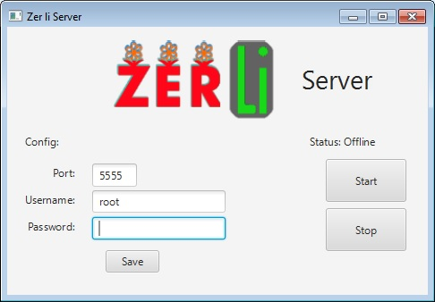

# Zer Li 2017
Zer Li is a program for managing a bouquets shops network based on a Cleint-Server implentaion of OCSF and uses a MySQL database to store the data

Zer Li was created By Ariel Berkovich, Matan Keren, Evgeny Khanchin, Daniel Krutikov as project during a semester course.

## Zer Li features:
* Available actions are presented based on the logged in user.
* Support for having multiple shops in database.
* Adding products to store and to store catalog.
* Create and edit of a shop catalog and also supports a newwork catalog.
* Support for viewing the stores catalog and creating a order from it.
* Support for customers sutifaction surveys.
* Supprt for editing users information.
* Generates quarterly reports and displays them in client.

## Running the Program
Uzip the [Jars.zip](https://github.com/XmakerenX/Zer-Li/blob/master/Jars.zip) to a local directroy and run first the server jar and after it the client jar.
The client jar can be run on a diffrenet computer than the server but reqires you to setup the server ip.

** Note you need to have a running MySQL server with the the prototype Scheme in it for the server to run , you can import the DB.sql file inclueded in the jars.zip for a example of how the database should look.

## How to Build
Clone the git repositry to a local directory and than on the eclipse proejct using eclipse 

** Note you need the [OCSF project](https://github.com/XmakerenX/Zer-Li/blob/master/OCSF.zip) to be in the eclipse workspace.

## Documentation
The project documentation can viewed [here](https://rawgit.com/XmakerenX/Zer-Li/master/doc/index.html)

## Screenshots
#### Server:

#### Client:

     

